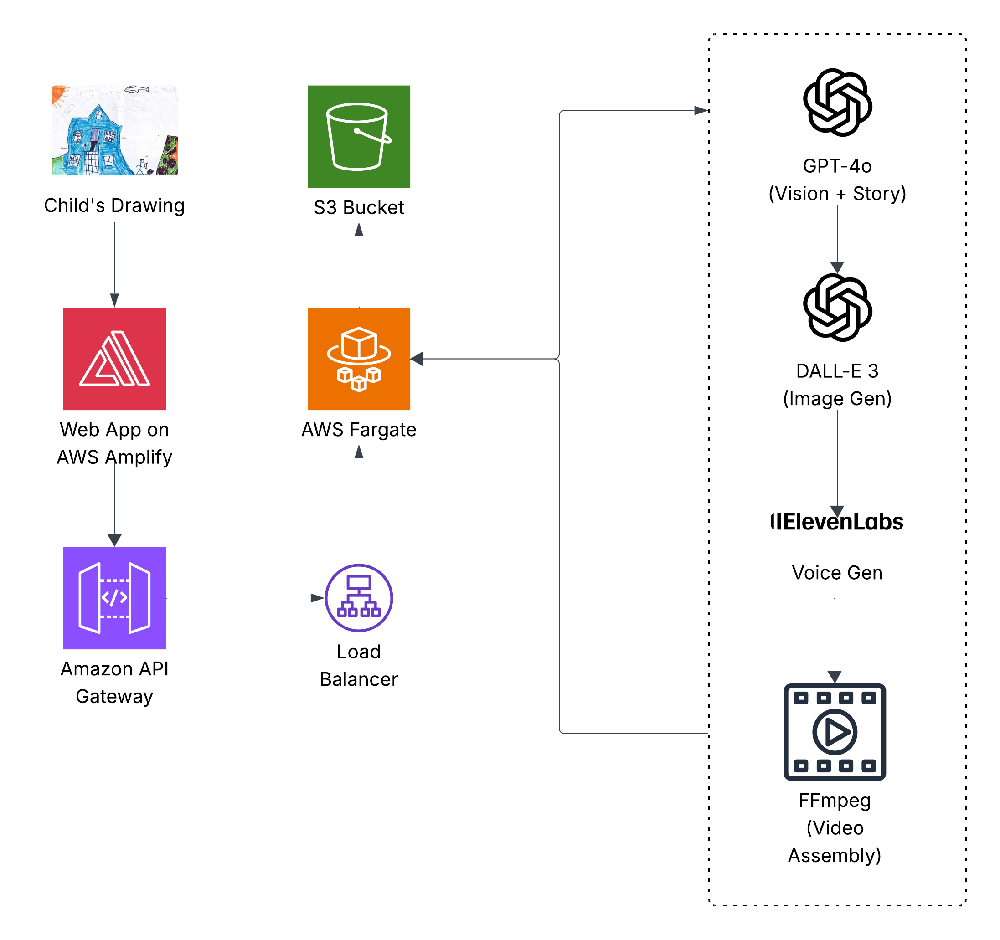

# NoComelon

AI storybook generator where parents co-create stories from their child's drawings.

## Architecture



## Project Structure

```
├── frontend/        # React app (Vite)
├── landing-page/    # Marketing site (Vite)
├── backend/         # Python API (FastAPI + uv)
└── infrastructure/  # AWS resources (Terraform)
```

## Prerequisites

- Node.js 18+
- pnpm
- Python 3.12+
- uv
- AWS account + CLI configured
- Terraform 1.0+

## Quick Start

### Frontend
```bash
cd frontend
pnpm install
pnpm dev
```

### Landing Page
```bash
cd landing-page
pnpm install
pnpm dev
```

### Backend
```bash
cd backend
uv sync --all-packages
uv run uvicorn app.main:app --reload
```

### Infrastructure
```bash
cd infrastructure
cp terraform.tfvars.example terraform.tfvars
# Edit terraform.tfvars with your AWS settings
terraform init
terraform apply
```

## Team

- [Mohammed Misran](https://www.linkedin.com/in/mmisran) · University of Pittsburgh
- [Isha Kaushik](https://www.linkedin.com/in/ishakaushik04/) · Columbia University

